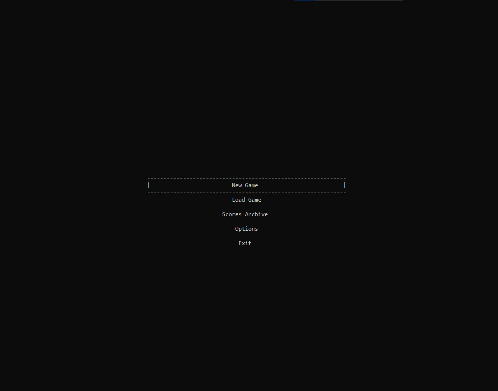
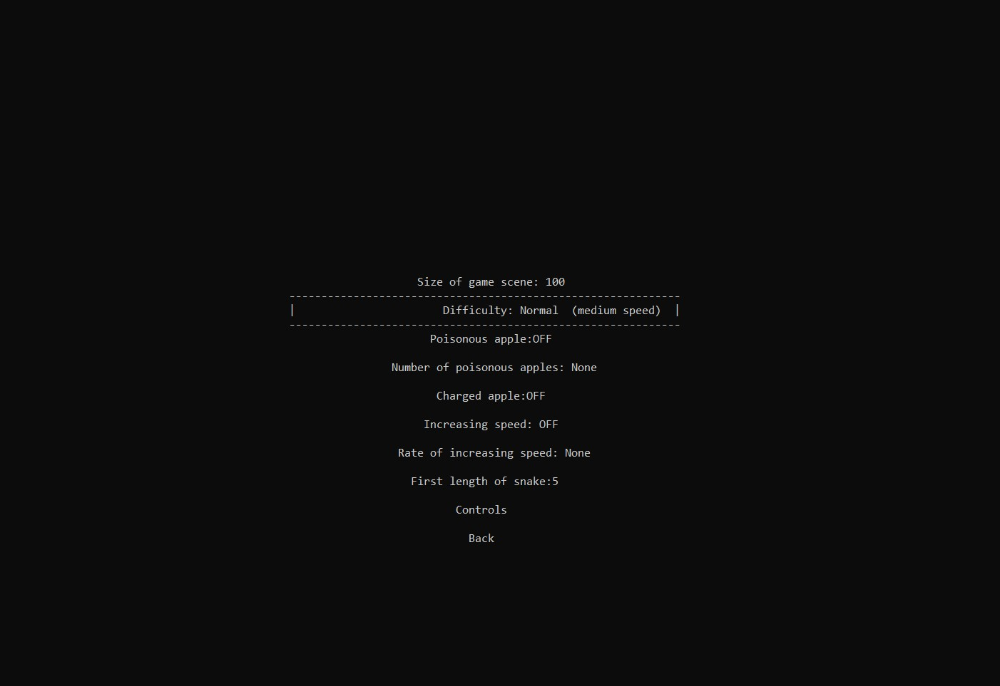
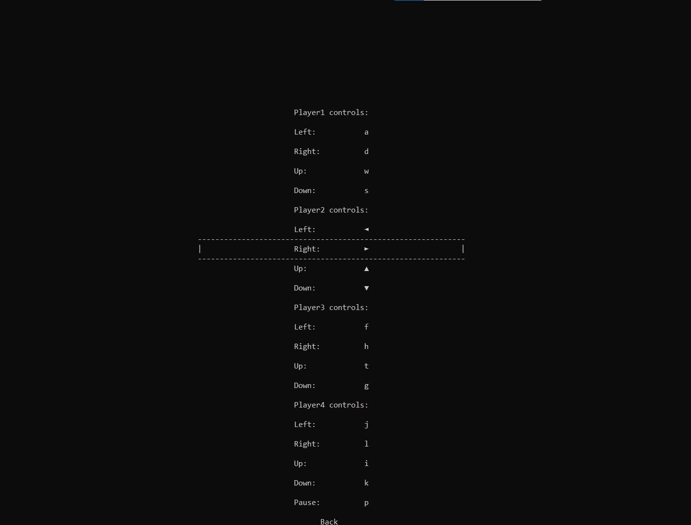
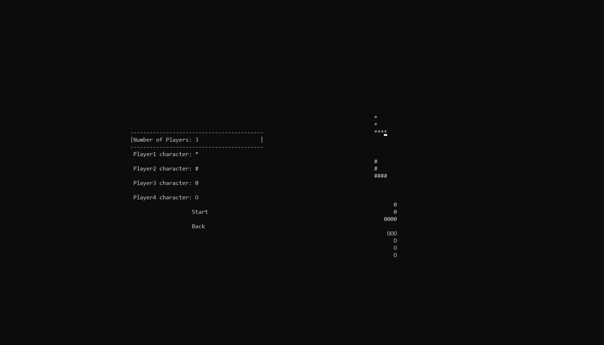
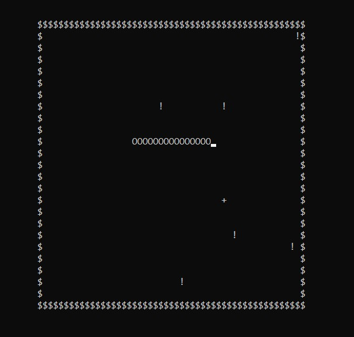

# Snake Game

My first game created for a console application with the `C` language and passion!

The script is `CPP`, but only `C` features and some basic features of `CPP` are used (no `OPP`).

## Main Menu

## Options Menu

## Controls Menu

## Player Selection Menu

## Game

